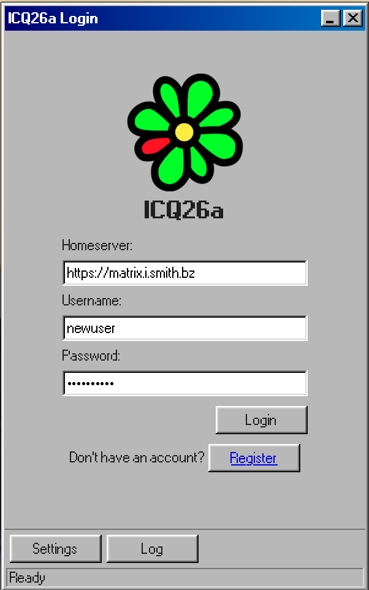
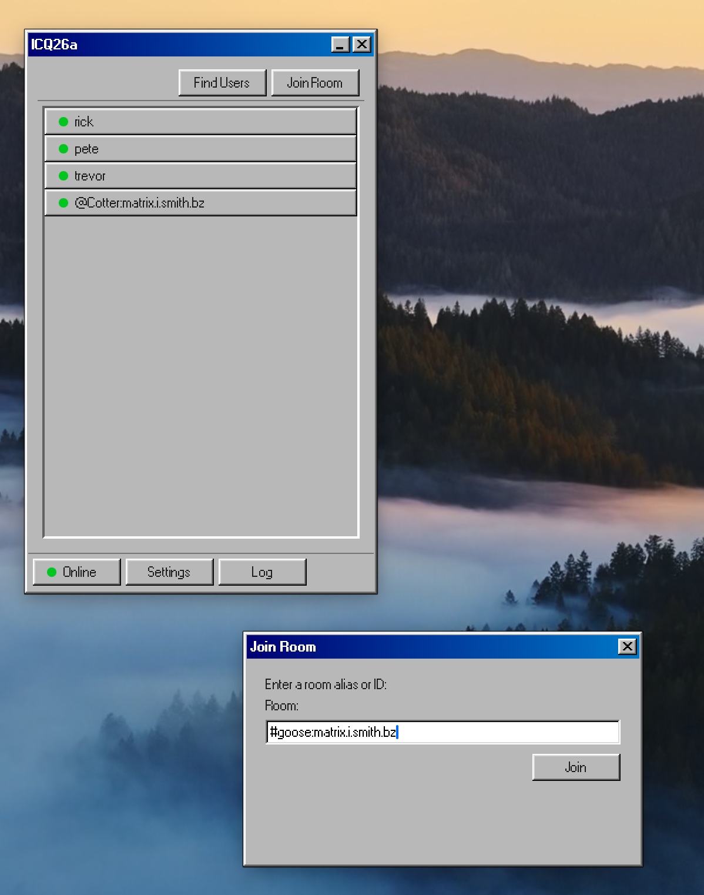
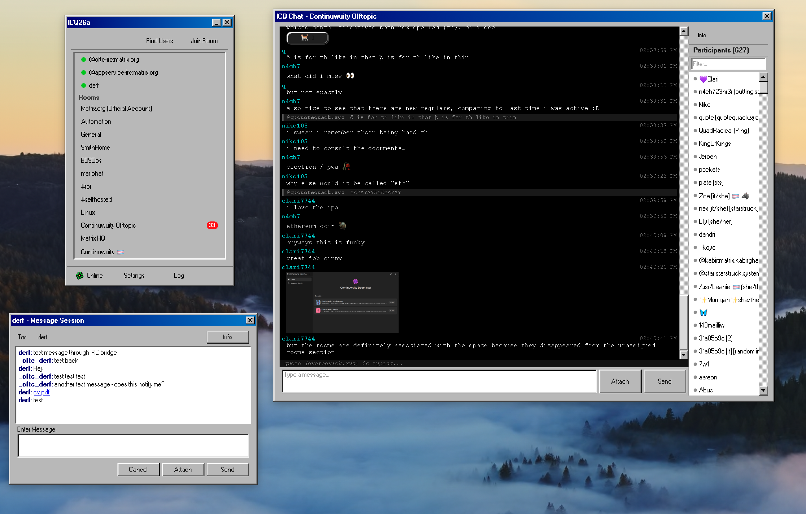

# ICQ26a

A Matrix chat client with the look and feel of ICQ 98a, built with Tauri, Svelte 5, and Rust.





## Features

- **Buddy list** with online/offline grouping and presence indicators
- **Direct messages** and **multi-user chat rooms**
- **User search** via Matrix user directory and direct user ID entry
- **Join or create rooms** by alias or room ID
- **Registration** — sign up for a new account in-app (with UIAA dummy-auth support)
- **File uploads and downloads** via Matrix media API
- **Session persistence** — login once, sessions restore on relaunch
- **SAS emoji verification** for cross-signing trust
- **Notification sounds** and unread message badges
- **Status picker** — Online, Away, Do Not Disturb, and more
- **User info** and **room info** panels
- **Right-click context menus** — message, view info, remove buddy, leave room
- **Server log** debug window for visibility into backend operations
- **Windows 95 aesthetic** via [98.css](https://jdan.github.io/98.css/)

## Requirements

- [Node.js](https://nodejs.org/) 20+
- [Rust](https://rustup.rs/) stable
- Platform dependencies:
  - **macOS**: Xcode Command Line Tools
  - **Linux**: `libwebkit2gtk-4.1-dev libappindicator3-dev librsvg2-dev patchelf libssl-dev libsoup-3.0-dev libjavascriptcoregtk-4.1-dev`

## Development

```bash
npm install
npm run tauri dev
```

## Building

```bash
npm run tauri build
```

Produces platform-native installers in `src-tauri/target/release/bundle/`.

## Configuration

On first launch, the app connects to `matrix.org` by default. Open **Settings** from the buddy list toolbar to change the homeserver URL before logging in.

Session data is stored in:
- **macOS**: `~/Library/Application Support/icq26a/`
- **Linux**: `~/.local/share/icq26a/`

## Stack

| Layer | Technology |
|-------|-----------|
| Frontend | Svelte 5, TypeScript, 98.css |
| Backend | Rust, Tauri v2 |
| Matrix | matrix-sdk 0.16 (sqlite store, E2EE) |

## License

MIT
